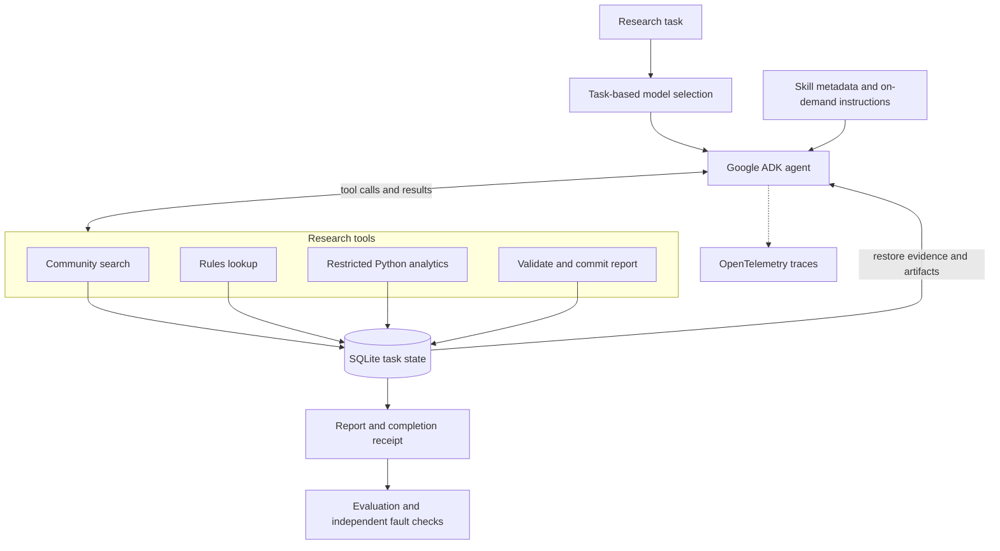

# CreatorPal

**An audience research agent that connects community recommendations to evidence, executable analysis and verifiable results.**

[](https://github.com/Mingkai406/CreatorPal/actions/workflows/agent-ci.yml)
[](pyproject.toml)
[](creatorpal_agent/adk_runner.py)
[](LICENSE)

[Quickstart](#quickstart) · [Architecture](#architecture) · [Engineering](#engineering) · [Evaluation](#evaluation) · [Documentation](#documentation)

CreatorPal helps creators answer three connected questions: **where to participate, what the community rules say, and which metrics support the recommendation.** It uses Google ADK to choose tools, load relevant Agent Skills, retrieve evidence and execute Python analysis. A report is complete when its required artifacts validate and its result is durably committed.

## From research question to report

> “I create Python data-analysis tutorials. Which communities fit my audience, what do their rules say, and how do their engagement rates compare?”

CreatorPal works through the task using a small set of explicit capabilities:

1. **Discover communities** using retrieved profiles and source identifiers.
2. **Check participation rules** against supplied community-rule snapshots.
3. **Calculate comparisons** by executing a restricted Python program over retrieved metrics.
4. **Commit a report** with recommendations, citations, analysis references and stated limitations.

Each run saves the report, supporting evidence, analysis program and inputs, a completion receipt, configuration fingerprints and execution traces. This makes the result inspectable and preserves the inputs needed to reproduce a run.

**Explore a recorded example:** [research report](examples/agent/research-report.md) · [underlying evidence and analysis](examples/agent/offline-comparison/test-python-progressive-fast-0/state-snapshot.json). The example uses fictional communities and an offline model double.

## Architecture



The model chooses tool order and arguments. The runtime controls scope, execution limits and commits. Search, rules and analysis become task artifacts that can be inspected or restored after an interruption.

### Skills and tools

| Skill | Tool | Responsibility |
|---|---|---|
| [Audience discovery](creatorpal_agent/skills/audience-discovery/SKILL.md) | `search_communities` | Retrieve community profiles with source IDs and numeric fields |
| [Community rules](creatorpal_agent/skills/community-rules/SKILL.md) | `read_community_rules` | Read rules for a community already retrieved |
| [Programmatic analytics](creatorpal_agent/skills/programmatic-analytics/SKILL.md) | `run_analysis` | Compute results over retrieved metrics and save the program and inputs |
| [Evidence report](creatorpal_agent/skills/evidence-report/SKILL.md) | `publish_report` | Validate required citations and analysis, then persist the report and receipt |

In progressive mode, the initial context contains skill metadata; `load_skill` brings in the selected instructions when needed. Skill bodies are versioned by content hash. See the [runtime design](doc/agent/README.md#architecture) for the complete contracts.

## Engineering

| Capability | Implementation |
|---|---|
| **Context management** | Metadata-first Skills, on-demand instruction loading, and task-scoped evidence and analysis artifacts |
| **Retrieval** | An adapter to BM25 + FAISS hybrid search and cross-encoder reranking; a small lexical backend for reproducible offline demos |
| **Model selection** | Explicit fast/strong model IDs, routing from task requirements, and one permitted escalation after failure |
| **Executable analysis** | AST-checked Python in a child process, input/output and execution limits, plus an optional non-root Docker backend with no network or host mounts |
| **Durable execution** | Task/corpus/skill fingerprints, bounded retries, and report plus audit-event commits in one SQLite transaction |
| **Observability** | Local OpenTelemetry spans, ordered task events, configuration manifests and provider usage when available |

Reports are keyed by task ID. Repeating an identical commit returns the persisted result; conflicting payloads fail. A restart restores evidence and artifacts into a fresh agent session. The execution controls are tested with timeouts, lost acknowledgments, malformed responses and process termination.

The analytics runtime accepts a deliberately restricted Python language; its [execution boundary](doc/agent/README.md#analytics-execution-boundary) documents the process and container guarantees. Rule evidence is a dated snapshot, and citation validation checks source relationships; semantic support still needs evaluation.

## Quickstart

Python 3.11+ is supported; CI uses Python 3.12. Install [uv](https://docs.astral.sh/uv/getting-started/installation/), then run:

```sh
git clone https://github.com/Mingkai406/CreatorPal.git
cd CreatorPal
uv sync --locked --extra adk --extra dev
uv run creatorpal-agent run --adapter offline-adk \
  --task examples/agent/task.json --output runs
```

The demo needs no model credentials. It executes the actual ADK Runner and research tools with a deterministic model double and synthetic evidence. The command returns a completion receipt; artifacts are saved under `runs/audience-demo-<id>/`.

| Artifact | What to inspect |
|---|---|
| `reports.json` | Recommendations, source IDs, analysis reference and limitations |
| `state-snapshot.json` | Retrieved evidence, analysis programs and inputs, committed reports and events |
| `result.json` | Completion checks, model attempts, runtime measurements and available usage |
| `manifest.json` | Task, corpus and Skill fingerprints, model settings and execution limits |
| `traces.jsonl` | Local OpenTelemetry execution spans |

### Use a real model and corpus

Configure credentials in the process environment and set `FAST_MODEL` to an accessible model ID:

```sh
uv run creatorpal-agent run --adapter adk --fast-model "$FAST_MODEL" \
  --task /path/to/task.json --corpus /path/to/evidence.json --output runs
```

The file-backed corpus contains profiles, rules, source URLs, collection dates and optional numeric metrics. To use the BM25/FAISS/cross-encoder stack, install the `retrieval` extra and select `--backend legacy` with configured indexes. Choose tasks supported by that corpus: the legacy adapter exposes reranking scores, while engagement analysis requires engagement data. Follow the [backend setup](doc/agent/README.md#use-the-original-retrieval-backend) and [live-model test guide](doc/agent/testing.md#2-test-one-real-model-on-a-known-task).

### Choose an entry point

| Entry point | Workflow | Setup |
|---|---|---|
| **Agent CLI** | Research task → Skills and tools → validated report | Quickstart above |
| **Streamlit application** | YouTube channel → theme extraction → query expansion and hybrid retrieval → analytics and strategy report | [Application, data and vLLM setup](doc/application.md) |

The Streamlit application uses `src/pipeline_vllm.py`; agent tasks run through `creatorpal-agent`.

## Evaluation

```sh
uv run pytest -q tests_agent
uv run creatorpal-agent compare --adapter offline-adk --output runs/evaluation
```

The comparison runner holds tasks and the backend constant across three policies:

| Policy | Skill loading | Model policy |
|---|---|---|
| `eager-fast` | All instruction bodies loaded initially | Fast model |
| `progressive-fast` | Relevant instructions loaded on demand | Fast model |
| `progressive-routed` | Relevant instructions loaded on demand | Strong model for numeric tasks; one allowed escalation when needed |

Results include completion, Recall@K, reciprocal rank, NDCG@K, numeric answer correctness, loaded instruction characters, elapsed time and available provider usage. A human-review sheet captures factual support and usefulness. Cost estimates require supplied pricing and complete usage metadata.

### Verified behavior

| Check | Published result |
|---|---|
| Agent regression suite | 39 tests pass; one Docker-specific test runs separately in CI |
| Policy control | Four synthetic tasks × three policies: 12/12 runs complete |
| Independent reliability suite | Eight fault scenarios meet their expected outcomes: six completed tasks and two correctly rejected failures |
| Packaging and container checks | Wheel installed and executed outside the checkout; restricted analytics container exercised in CI |

See the [recorded policy control](examples/agent/offline-comparison/report.md), [Agent CI](https://github.com/Mingkai406/CreatorPal/actions/workflows/agent-ci.yml) and [Agent Reliability Harness](https://github.com/Mingkai406/agent-reliability-harness/blob/main/docs/creatorpal.md).

These results verify engineering behavior using synthetic data and deterministic model doubles. Live-model quality, latency and cost comparisons remain to be measured. Character counts are not token savings, and valid citation IDs do not establish that every sentence is supported. The [evaluation protocol](doc/agent/testing.md) describes frozen test data, repeated trials, human review and acceptance criteria.

## Code map

```text
creatorpal_agent/      ADK runner, Skills, tools, task state and evaluation
  skills/             Four portable SKILL.md packages
  fixtures/           Synthetic evidence and development/test tasks
tests_agent/          Runtime, analysis, model-boundary and recovery tests
src/retrieval/        BM25, FAISS, hybrid retrieval and cross-encoder reranking
src/pal/              Pipeline PAL implementation
src/sentiment/        Community sentiment analysis
app/                  Streamlit application
data/                 Corpus preparation and index building
examples/agent/       Tasks, example report and recorded offline results
doc/                  Architecture, setup and testing references
```

## Documentation

| Read this | For |
|---|---|
| [Agent design and configuration](doc/agent/README.md) | Skills, tool contracts, model policies, state and execution boundaries |
| [Testing and evaluation](doc/agent/testing.md) | Offline checks, live-model setup, metrics and human-review criteria |
| [Application and deployment](doc/application.md) | Streamlit, YouTube ingestion, corpus preparation and self-hosted vLLM |
| [Retrieval architecture](doc/backend/retrieval.md) | BM25/FAISS fusion, query rewriting, HyDE and reranking |
| [Corpus preparation](doc/backend/corpus.md) | Data formats, preprocessing and index construction |
| [Contributing](doc/collab/contributing.md) | Development setup, PR workflow and checks |

## License

[MIT](LICENSE).
