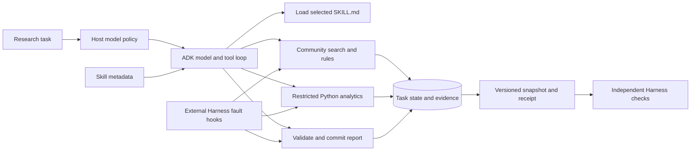

# Audience Research Agent

The agent extension adds an ADK decision loop over CreatorPal tools. It selects the next tool and loads relevant skill instructions, persists retrieved evidence, runs a small analytics program, and commits a report only when its references and required artifacts validate. The original YouTube-to-Reddit pipelines and Streamlit application remain available. This extension currently has a CLI entry point; the original UI does not automatically switch to it.

## Run without credentials

Python 3.11+; development and CI use 3.12. From the repository root:

```sh
pip install uv
uv sync --locked --extra adk --extra dev
uv run creatorpal-agent run --adapter offline-adk --task examples/agent/task.json --output runs
uv run creatorpal-agent compare --adapter offline-adk --output runs
uv run pytest -q tests_agent
```

`scripted` calls real tools with a fixed control program. `offline-adk` uses the actual Google ADK Runner and function-call execution, with a deterministic `BaseLlm` double. Neither measures LLM capability. Both use fictional community data by default. Runs contain the report, receipt, SQLite state, versioned state snapshot, local OpenTelemetry spans and a configuration manifest.

## Architecture and ownership



Mingkai Gao's agent extension is in `creatorpal_agent/` and `tests_agent/`. It builds on his original PAL/evaluation work and adapts the team's retrieval interfaces. The four-person project's original ownership remains documented in the main README; this extension does not reattribute the retrieval, data or frontend work.

- **Skills:** four standard `SKILL.md` packages for audience discovery, rules lookup, programmatic analytics and evidence-based report submission. Only names/descriptions/hashes enter the initial progressive context; `load_skill` supplies the selected body. CI validates their format with ADK's skill loader. The runtime uses explicit ADK function tools and its own registry, not ADK's experimental `SkillToolset` script executor. This application feature does not install personal Codex skills.
- **Tool use:** the model decides tool order and arguments. The host enforces loaded-skill requirements, retrieved-community scope, input limits, two attempts for transient tool failures and a persisted 30-attempt tool budget. ADK is limited to 16 model calls per invocation and at most two invocations. Unknown skills do not grant capabilities.
- **State:** evidence, search cache, analysis artifacts, configuration fingerprints and audit events live in a task-scoped SQLite database. Report commits are transactional and keyed by task ID. Repeated identical commits reuse the receipt; conflicting payloads fail. Restart restores artifacts into a new ADK session. This is artifact-based recovery, not durable storage of the entire ADK conversation or a distributed worker platform.
- **PAL:** the model generates a limited Python program over numeric fields actually retrieved. Its output is saved with program and input rows; the report cites that analysis ID. There is no training or fine-tuning in this version.
- **Model policies:** `eager-fast` loads every skill body; `progressive-fast` loads on demand; `progressive-routed` selects the stronger model for explicitly numeric tasks and permits one escalation after invalid completion or provider failure. Model IDs are caller supplied. Routing is a transparent task policy, not a learned router or a proven best-model selection result.
- **Observability:** tool spans and local state events capture attempts, retries, escalation, analysis errors and commit/reuse. The custom spans do not include full prompts or evidence text. Run artifacts do include research data; keep real datasets and runs private as appropriate. There is no automatic remote telemetry exporter.

## Use the original retrieval backend

```sh
uv sync --locked --extra adk --extra dev --extra retrieval
uv run creatorpal-agent run --adapter adk --backend legacy \
  --task examples/agent/task.json --fast-model "$FAST_MODEL" \
  --rules-corpus /path/to/rules-snapshot.json --output runs
```

Configure the original `src.config` index/metadata paths and install/build the original corpus first. `LegacyHybridBackend` calls the existing BM25/FAISS hybrid retriever and cross-encoder reranker. It does not silently replace these with the demo lexical search. The default reference backend is deliberately tiny and lexical so CI needs no model downloads.

Legacy index results expose the cross-encoder score, not engagement rates. For a real analytics task, supply an evidence corpus containing the metric you want, or extend the adapter with timestamped engagement data. Adjust the task accordingly; the demo task asks for `engagement_rate`, so it is **not** a valid ready-made task for a legacy corpus containing only reranker scores. Legacy rules are unavailable unless a rules snapshot is supplied. Snapshots are not claims about current Reddit moderation policy.

Custom `--corpus` JSON follows the `Evidence` schema in `creatorpal_agent/contracts.py`: unique ID, community, kind (`profile` or `rules`), text, source URL, collection timestamp and optional numeric metrics. Input documents are untrusted data, not agent instructions.

## Run real model comparisons later

Configure Gemini credentials or Vertex AI authentication outside the repository, then select actual accessible model IDs:

```sh
export FAST_MODEL='your-accessible-fast-model-id'
export STRONG_MODEL='your-accessible-strong-model-id'
uv run creatorpal-agent compare --adapter adk \
  --fast-model "$FAST_MODEL" --strong-model "$STRONG_MODEL" \
  --cases /path/to/frozen-test-cases.jsonl --corpus /path/to/evidence-corpus.json \
  --repeats 3 --output runs
```

Authentication options follow [ADK model documentation](https://google.github.io/adk-docs/agents/models/). Do not put API keys in task JSON, commands committed to Git, or reports. The CLI also accepts `--pricing` with caller-supplied `{ "model-id": { "input_per_million": 0.0, "output_per_million": 0.0 } }` rates. Estimated cost is reported only when usage metadata is complete; rates are not fetched or claimed current. This estimate uses flat input/output rates, includes reported thinking tokens, and does not apply cache discounts.

`run --state /path/to/existing.sqlite` explicitly resumes a task. Task, corpus, skill and sandbox fingerprints must match. Use new output directories for comparisons; reusing a completed state would invalidate a fresh-model comparison. No live model results are included in this change.

## Evaluation boundaries

The checked-in development set has two tasks; the demonstration test set has four independently written task prompts and explicit relevance labels, plus exact numeric targets where requested. The data is synthetic and was visible during implementation. This is a regression fixture, **not** a statistically valid unseen test set or evidence of generalization. Labels enter the scorer, not the agent task/context.

Policy comparisons hold tasks and backend constant and report task completion, Recall@K, reciprocal rank, NDCG@K, numeric answer correctness, loaded instruction characters, elapsed time and available provider usage. These policies all use the new agent runtime; the results do **not** demonstrate an improvement over the original fixed RAG pipeline. Characters loaded are not tokens saved. Offline elapsed times are not model latency measurements.

Citation integrity verifies source IDs and community relationships. It cannot establish that a source supports every sentence. Semantic grounding is explicitly unscored until a human or separately validated judge reviews it. A review sheet is generated with each comparison; review the report and evidence, mark factual support and usefulness, and document disagreements. For a credible live study, freeze unseen real tasks, record corpus/model/skill versions, predefine quality criteria, and repeat runs. Do not promote the synthetic control numbers to a resume claim about LLM accuracy.

## Analytics execution boundary

The default backend accepts a small AST-checked Python subset: numeric builtins, local assignment, comprehensions and container arithmetic. It rejects imports, attributes, arbitrary function calls, private names and statements such as `while`. It runs in a fresh isolated Python child process without the host environment, with input/output and wall-time limits. POSIX CPU limits apply; address-space limits apply on Linux. macOS does not provide the same address-space enforcement here. This is **not a general-purpose untrusted-Python security sandbox**.

For container isolation:

```sh
docker build -f Dockerfile.analytics -t creatorpal-analytics .
uv run creatorpal-agent run --adapter offline-adk --sandbox docker \
  --task examples/agent/task.json --output runs
```

The parent starts a non-root container with no network, read-only root filesystem, no host mounts, dropped capabilities, and CPU/memory/process limits. The same restricted language is enforced inside. The trusted host must have Docker access; that privilege is never exposed as an agent tool. CI builds the image and tests execution. The previous pandas/numpy PAL implementation remains in `src/pal/`; its older in-process executor is not the new runtime's execution boundary.

## Reliability experiments

The separate [Agent Reliability Harness](https://github.com/Mingkai406/agent-reliability-harness) injects faults through `ToolHook.before/after` and grades `state-snapshot.json` contract version 1. It tests recovery and rejection against actual CreatorPal tools, while keeping its grader outside the application. Independent structural grading is not a cryptographic attestation against a malicious application.

Relevant standards: [Agent Skills format](https://agentskills.io/specification), [ADK function tools](https://google.github.io/adk-docs/tools-custom/function-tools/), and [OpenTelemetry Python](https://opentelemetry.io/docs/languages/python/).
