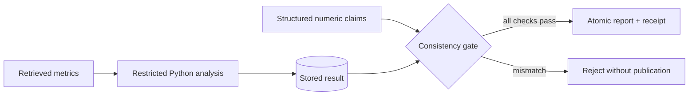

# Numerical consistency before publication

CreatorPal treats a quantitative report as a contract between a stored analysis result
and the numbers presented to the user. `publish_report` checks that contract before its
atomic SQLite commit. A rejected report leaves no report or success receipt behind.



## Report contract

```json
{
  "analysis_id": "<stored analysis ID>",
  "numeric_claims": [
    {"analysis_id": "<same ID>", "result_key": "DemoPythonLearning",
     "value": 7.0, "scale": "percent"}
  ]
}
```

This fragment belongs inside the existing report schema, alongside `task_id` and
`recommendations`. When the stored field is `0.07`, `raw` accepts `0.07` and `percent`
accepts `7.0`. The claim describes a display scale, not an inferred physical unit.
All numeric result keys must be represented for analytics tasks. Unknown keys, duplicate
keys, missing claims, mismatched analysis IDs, non-finite values, boolean values and
incorrect scale conversions fail validation. The tolerance is fixed by the host:
relative `1e-7`, absolute `1e-9`. The candidate cannot supply a more permissive tolerance.

The check establishes consistency with the stored computation. Correctness of that
computation is evaluated separately using fixture answers. It does not parse arbitrary
numbers in prose or establish the semantic truth of recommendations. Quantitative output
should be consumed from `numeric_claims`.

## Evidence

```sh
uv run pytest -q tests_agent/test_numeric_gate.py
uv run python -m creatorpal_agent.benchmark --output runs/benchmark-180
```

The [recorded benchmark](../../examples/agent/benchmark-180/report.md) covers 20 task
configurations, three policies and three repeats. There are four research topics with
five tool-requirement variants each. 108 trials request analytics; the remaining 72
exercise workflows without numerical claims. The model is a deterministic ADK double.
Policies exercise skill loading and routing branches using that same double.

The evidence bundle includes the exact task matrix, per-trial scores, durable state,
receipts and SHA-256 hashes. Full databases and traces are retained by GitHub Actions.
Repeated report hashes test deterministic output rather than model sampling variance.
Token savings and live-model quality are intentionally unmeasured in this experiment.

## Compatibility

Analytics publishers must now supply `numeric_claims`. Non-analytics reports retain
the default empty list. Both built-in offline drivers have been updated. Old recorded
examples remain historical; use a fresh run directory for the new contract and Skill
fingerprint. External ADK clients should follow the updated `evidence-report` Skill.
